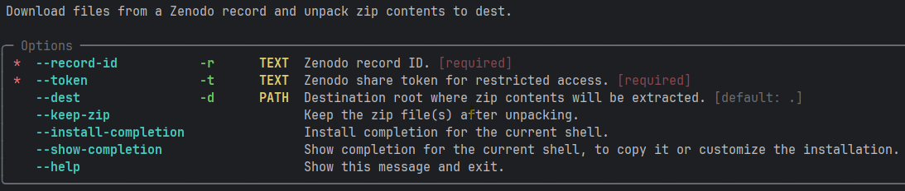
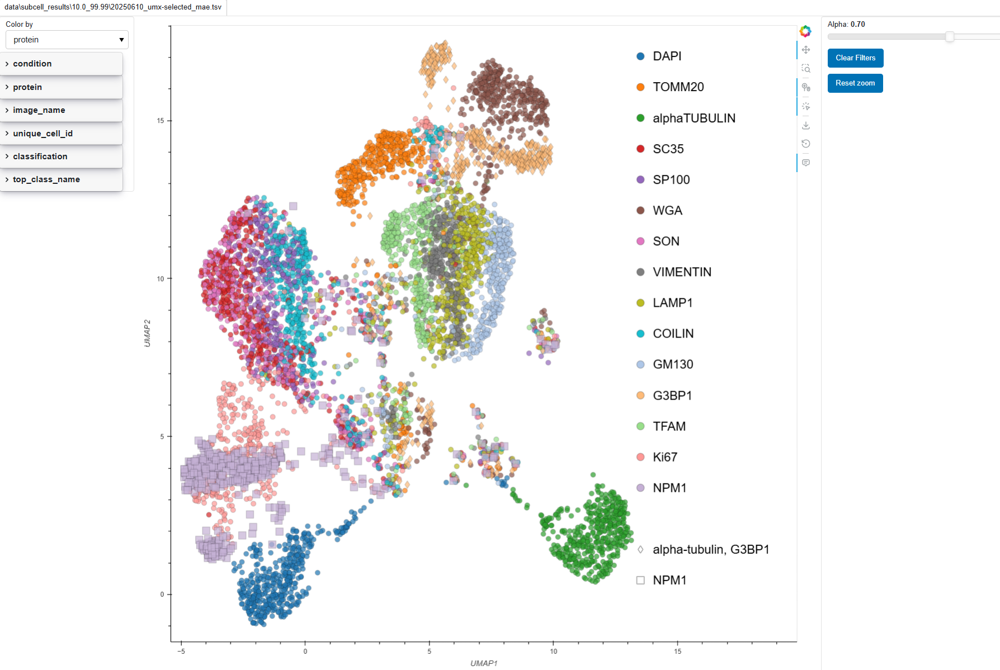
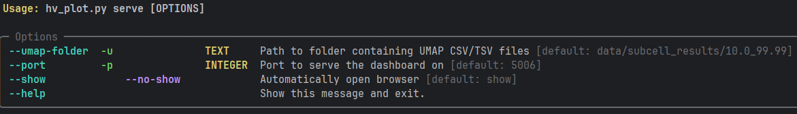
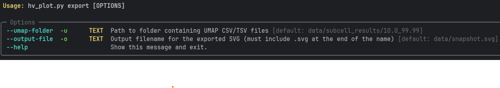
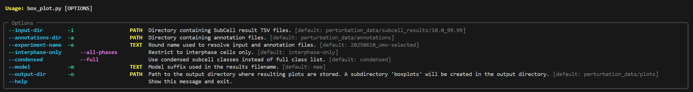

## Overview
This repository provides the end-to-end workflow used in the paper [here](to_be_decided).
The workflow starts with raw image data, processes it and runs SubCell classification. Results
can be interactively visualized afterwards. The code is specific to the data used in the paper,
but can be adjusted to your own data.

For more information about SubCell, see the [SubCell paper](https://www.biorxiv.org/content/10.1101/2024.12.06.627299v2).

## Getting started
<details>
<summary>Click to expand and see more information about how to set up the pixi environments.</summary>

### Installing Pixi

This project uses [pixi](https://pixi.sh) for dependency management. To install pixi, follow these steps
(check installation instructions [here](https://pixi.prefix.dev/latest/installation/) in case of potential outdated instructions):

#### Windows
You can download and run the [installer](https://github.com/prefix-dev/pixi/releases/latest/download/pixi-x86_64-pc-windows-msvc.msi)
or run the following:
```
# Using PowerShell (recommended)
powershell -ExecutionPolicy ByPass -c "irm -useb https://pixi.sh/install.ps1 | iex"
```
The terminal needs to be restarted to make the installation effective. See details below for what this does.
<details>
The above invocation will automatically download the latest version of pixi, extract it, and move the pixi binary to 
%UserProfile%\.pixi\bin. The command will also add %UserProfile%\.pixi\bin to your PATH environment variable, allowing 
you to invoke pixi from anywhere.
</details>

If you want to turn on autocompletion check the location of your profile by running in the
PowerShell: `$PROFILE`. At the end of this file add the following line:

```(& pixi completion --shell powershell) | Out-String | Invoke-Expression```
#### macOS/Linux
```
# Using curl
curl -fsSL https://pixi.sh/install.sh | sh

# Or using wget if you don't have curl
wget -qO- https://pixi.sh/install.sh | sh
```

Now restart your terminal or shell to make the installation effective. For what this does, see the windows section.
To enable autocompletion, add to your `.bashrc`:
```eval "$(pixi completion --shell bash)"```

### Installing Dependencies

Once pixi is installed, you can install the project dependencies. Before that please check which CUDA version is 
supported. For MacOS only cpu is allowed. To install the cpu version run:

```
pixi install -e download -e plotter -e preprocess-cpu -e subcell-cpu  
```
On Linux and Windows, please check in the terminal the output of `nvidia-smi`. If a 12.* CUDA version is supported
(top bar of the output), then please install in the manner:

```python
pixi install -e download -e plotter -e preprocess-cu121 -e subcell-cu121
```

Else if only CUDA version 11.* is supported install like this:

```python
pixi install -e download -e plotter -e preprocess-cu118 -e subcell-cu118
```

This installs the dependencies for all environments related to this project.
If you don't have a NVIDIA GPU or nvidia-smi is not a valid command please install the cpu
dependencies as mentioned or MacOS.
</details>

## Expected directory structure and naming
<details>
<summary>Click to expand and see more information about configuration directories.</summary>

### Configs
First there should be a `configs` directory. This directory contains configurations for the interactive visualization with bokeh:
        
#### colormaps.json
This file defines how elements are colored in the umap and in the boxplots.
By default elements are colored with Category10 colormap.
This file can be added for customizations.
The file needs to be structured as json, each top-level key corresponds to the column in the data (condition, cell_cycle_phase, image_name, ...), its corresponding value needs to be a dictionary that maps each element to a color.
Here is an example in which for cell_id the colormap used is Turbo, while for the condition custom colors are defined.
```
{
    "cell_id": "Turbo",
    "condition": {
        "Untreated": "#d81b60",
        "SA": "#1e88e5",
        "ActD": "#ffc107",
        "Unknown": "#7f7f7f"
    },
}
```

#### constants.yaml
This file contains:
- the list of the 30 subcell classes,
- the mapping used to condense them into 15 classes (e.g. Nucleoli was redefined as Nucleoli + Nucleoli fibrillar center + Nucleoli rim),
- the list of 15 channel names.

#### umap_config.yaml
This file can be used to customize the umap output. Different elements can be customized:

- The minimum width of the side panels can be defined.
- The initial transparence of the points.
- The maximum number of elements shown in the legend can be customized, this is particularly useful when coloring by cell_id, where the number of unique values if very large but the representation is useful to see whether all markers for a cell cluster together. ```The tooltip can be then used to extract the cell_id if needed. ```

- A list of cells to be highlighted, along with the color and width of the border around the highlighted cell can be customized.

- The marker shapes, first a list of markers can be defined along with their sizes, then the column for which the shapes will be changed can be selected, and finally for each element of the column a partiular marker can be defined.

- tooltip elements can be chosen. Each element requires two values: 'column' which is the name of the column in the dataframe, and 'label' which is what will be shown in the tooltip.
</details>

## Data download and layout
<details>
<summary>Click to expand and see more information about downloading the data and the data directory's layout.</summary>
### Downloading the data
The data can be downloaded by using the download CLI. It has several commands:



Important here are to provide the record-id and token. You run the CLI from the terminal
in the following way:

```pixi run download -r <record_id> -t <zenodo_token>```

### Perturbation Image Data (SubCell workflow)
The raw image data should be stored in a directory called `perturbation_data`, which is present in this project 
directory after using the download CLI.
In this directory, for running the workflow with default parameters, it is expected that there is a directory called 
`raw`. This directory contains experiment directories with names of the user's choice, that should contain either
`.lif` images. The dimension names and order of these images is expected to be `czyx`. The images
can contain one or multiple scenes (Fields of View). The `perturbation_data` directory also contains a directory 
`annotations` containing a csv file with cell cycle annotations of the cells.
Furthermore, a directory `preprocessing_results` in `perturbation_data` contains a directory with the corrected 
segmentations. By default these segmentations will be used for SubCell, but one can run the segmentation part of the
SubCell workflow to get the uncorrected segmentations.

### Unmixing performance data
By default, the data used for determining unmixing performance must be in a directory `unmixing_performance_data` in 
this repository. This directory must contain directories with the names of the individual experiments / Fields of View,
which contain `ome-tif` images with the `.tif` extension.

</details>

## Running the workflows

### Overview of subcell workflow
<details>
<summary>Click to expand and see more information about how to reproduce the SubCell workflow from the paper.</summary>

#### 1. Splitting images into 1 scene per image file
The workflow starts from raw `.lif` images. These are split into individual FOV
images by running a CLI. To run with default parameters, in the command line ensure that you are in this repository 
directory and run: 

`pixi run split_images`

Additional parameters can be provided:


Both `experiments` and `channels` can be a list of strings. The way to provide multiple channels for example is:
`pixi run split_images -c ch1 -c ch2 -c ch3`

#### 2. Preprocessing of images
The code for preprocessing of the images includes a percentile normalization step as well segmentation
using micro-sam (paper [here](https://www.nature.com/articles/s41592-024-02580-4)). Due to naming,
the code is specific to the data used in the paper. To run it, run the following in a terminal with this
directory as current working directory:

`pixi run preprocess`

Additional parameters can be provided (please also see mentioned defaults):


By default, the preprocessing output and intermediate results are stored in `data/preprocessing_results`. This directory
will contain three directories: `8bits`, `greyscale` and `segmentations`. The `8bits` folder contains a directory 
`<min-th_max-th` containing normalized 8 bit images. The `greyscale` directory contains the 8 bit images which are 
filtered to only include the segmentation channels (`DAPI`, `VIMENTIN`, `WGA`, `alphaTUBULIN`), sum projected, normalized
and converted to 8 bit. These images are used as input for segmentation, the output of which are stored in the 
third directory called `segmentations`. The directory structure after running the preprocessing should look something
like this:


It can be that segmentations have to be corrected afterward. SubCell is expecting close to perfect segmentations. When 
stored using the same name as the automated segmentation image in a directory called `manual_segmentations` within the 
directory choosen as output directory, segmentation will be skipped if automated segmentation is rerun (this is also
the case for any automated segmentations already existing).

<details>
It can be that you see an error message when the segmentation images are being read for automated cleaning (removing
small segmentation objects and border cells). This is because micro-sam does store tiff, but `bioio` tries to read
first with the `bioio-ome-tif` reader, before falling back to the basic `tif` reader. This message can be ignored.
</details>

#### 3. Running subcell
To run SubCell with the default configuration, just run the following from the terminal:

`pixi run subcell`

By default, the input data expects the `preprocessing_results` directory as input with in there the `8bit` directory
containing the 8 bit images generated during preprocessing. Percentile normalization can be performed prior to running 
the SubCell model. For more information see the `--help`:


For preprocessing, first cells are extracted based on the mask and the centroids are determined through defining regionprops.
The centroids are then used to create cell patch images the size of which corresponds to `--cell-patch-size` (these are stored in ). Next by default, the individual cell images are sum projected after which a per channel normalization is applied (1st and 99th percentile) with subsequent rescaling of values between 0 and 1. 
If `--bg-masking` is supplied as argument, the background will be masked out from the individual cell images.
However, this is not the default.
Individual cell images are then fed to the SubCell model of choice for protein localization classification.

SubCell is a suite of multiple models that were trained with different reference channels and different objectives.
In this work we used two reference channels (alpha-tubulin and DAPI) and the third channel was the protein of interest (each of the 15 acquired in the panel).
This setting corresponds to the argument `--model-channels rbg`.
The other possible combinations (as can be seen in the models/ directory) are:
- `--model-channels bg`, which uses DAPI and protein of interest;
- `--model-channels rybg`, which uses alpha-tubulin, endoplasmic reticulum, DAPI, and protein of interest;
- `--model-channels ybg`, which uses endoplasmic reticulum, DAPI, and protein of interest.

SubCell models were trained with different objectives:
- Reconstructive Objective;
- Cell-specific Objective;
- Protein-specific Objective.
The best-performing models were the one trained with only the Protein-specific objective, and the one trained with the combination of all three objectives. The model used can be changed with the argument `--model-type` which can be respectively vit_supcon_model or mae_contrast_supcon_model.


The final output is a `.tsv` file. For a more detailed description of this file, 
please see [subcell output readme](subcell_output_readme.md)

In addition to the outputs generated by SubCell, we manually annotated the cell cycle phase for all cells.
The annotation file should be structured with:
- one column called unique_cell_id (obtained merging the image name and the numeric cell label), this column is needed to be able to create a correspondence with the SubCell output;
- one column with the annotation for the cell cycle.

Additional columns with other custom annotations may also be included.
Any annotation column present in the merged dataframe can be:
- Used as a filtering variable;
- Used to color the UMAP visualization based on its values.

The merged dataset enables filtering by cell cycle phase and other user-defined annotations in downstream visualizations.

#### 4. UMAP Visualization

There are two modes by which to visualize the output of the SubCell classification, either interactive or static. 
For default interactive visualization run the following:

`pixi run serve-umap`

This will open your web browser and display an interactive visualization (may take maximum half a minute to show as 
all umaps are calculated for better interactivity):



When done with visualizing the server needs to be killed. From the terminal in which you ran the command to serve, press
`CTRL+c` in order to kill the server.

Optionally, when starting the server, arguments can be provided to change the input directory and the port to serve the 
dashboard on:



For creating the default static output as 'svg' file run:

`pixi run export-umap`

For the default workflow this will create a static umap visualization as svg in the data directory. This is mostly 
equivalent to the interactive umap except that the `svg` will not allow for filtering of the umap.
Optionally, input directory and output file name can be adjusted:



### 5. Reproducing figures
**Figure 5c (SVG)**

The hv_plot.py file should contain:
```
color_by_val = 'protein'
filters_val = {
    "CellCycle": ["Interphase"],
}
```
The umap_config.yaml should have all proteins set to use the circle marker.

**Figure 5d (SVG)**

The hv_plot.py file should contain:
```
color_by_val = 'condition'
filters_val = {
    "CellCycle": ["Interphase"],
    "protein": ['G3BP1', 'alphaTUBULIN', 'NPM1'],
}
```
```
protein:
    alpha-tubulin: diamond
    NPM1: square
```
The umap_config.yaml should have alpha-tubulin set to diamond and NPM1 set to square.

**Supplementary figure 5 (SVG)**

The hv_plot.py file should contain:
```
color_by_val = 'condition'
filters_val = {
    "CellCycle": ["Interphase"],
}
```
The umap_config.yaml should have all proteins set to use the circle marker.

**Figures 5e/5f**

These figures can be reproduced by running the box_plot.py file.
The script generates one plot per marker.
For each pair of condition and subcellular_location, a boxplot is created visualizing the corresponding distribution found in the results file.

The script can also be used to create boxplots for the other markers and has additional parameters:


#### Default behaviour:

- If an annotations file is present, only interphase cells are retained. This can be overridden using the --all-phases flag.
- Subcellular classes are condensed from 30 categories to 15. To preserve the full set of 30 classes, use the --full flag.
- Conditions are colored based according to what's defined in the configs/colormap.json.

</details>


### Overview of workflow determining performance of unmixing using pearson correlation
<details>
<summary>Click to expand and see more information about how to reproduce the heatmap figures used to assess unmixing performance.</summary>

#### Scripts
The scripts are present in the `unmixing_performance` directory. `run.py` is the entry point. To run the command line 
interface, simply type the following in the terminal with this directory as the location:

`pixi run correlation-analysis`

This will run the following steps:

Steps 1 to 8 run for each FOV, while steps 9 to 14 work with output data from all FOVs.

- Step 1: `pcc.py` calculates Pearson's correlation coefficient (PCC) for every channel comparison in every FOV.
    - For Supplementary Fig. 2 `structural_similarity` (SSIM) from `skimage.metrics` was used instead of PCC. The final analysis doesn't include SSIM, therefore it's not included in this pipeline.
- Step 2: `organize.py` organizes PCC matrices according to group assignment.
- Step 3: `divisor.py` extracts DAPI value for later normalization to account for possible drift during image acquisition.
- Step 4: `DAPI_normalizer.py` normalizes organized PCC matrices by divisors accordingly.
- Step 5: `NegToZero.py` converts negative values to 0.
- Step 6: `subtract_matrices.py` calculates absolute result of |raw vs. GT - GT vs. GT|, |group vs. GT - GT vs. GT| and |full vs. GT - GT vs. GT| matrices.
- Step 7: `row_sum.py` calculates row sum for subtracted matrices.
- Step 8: `similarity_to_self.py` extracts PCC values from subtracted matrices for the same channel (diagonal values).
- Step 9: `aggregate_row_sums.py` sums the PCC values in every row for each channel from subtracted matrices, normalizes by 14 and scales values to maximum across all FOVs and all comparisons (residual crosstalk).
- Step 10: `plot_row_sums.py` plots residual crosstalk.
- Step 11: `aggregate_similarity.py` uses output from `similarity_to_self.py` to calculate similarity to self and scales values to maximum across all FOVs and all comparisons (similarity to self).
- Step 12: `similarity_to_self.py` plots similarity to self.
- Step 13: `utils_average_matrices.py` uses DAPI-normalized matrices as input (Step 4) to calculate an average matrix and `plot_heatmaps.py` to plot it.
- Step 14: `utils_average_matrices.py` using subtracted matrices as input (Step 6) to calculate an average matrix and `plot_heatmaps.py` to plot it.

#### Output
When `run.py` script successfully finishes, the following outputs will be produced:
- In each FOV folder:
    - folder `pcc` containing output from `pcc.py`.
    - folder `gt_matrices` containing output from `organize.py`.
    - folder `DAPI_normalized` containing output from `DAPI_normalizer.py`.
    - folder `neg_to_zero` containing output from `NegToZero.py`.
    - folder `subtracted` containing output from `subtract_matrices.py`.
    - folder `row_sums` containing output from `row_sum.py`.
    - folder `subtracted_similarity` containing output from `similarity_to_self.py`.
- Inside `data` folder:
    - folder `aggregated_normalized` containing output from `aggregate_row_sums.py`
        - `plots` folder containg residual crosstalk plot (corresponding to <b>Fig. 3d</b>)
    - folder `aggregated_similarity` containing output from `aggregate_similarity.py`
        - `plots` folder containg similarity to self plot (corresponding to <b>Fig. 3c</b>)
    - folder `plots` containing:
        - folder `avg_DAPI_normalized` containing output from `utils_average_matrices.py` and `plot_heatmaps.py` using DAPI-normalized matrices (corresponding to <b>Supplementary Fig. 4a and b</b>)
        - folder `avg_subtracted` containing output from `utils_average_matrices.py` and `plot_heatmaps.py` using subtracted matrices (corresponding to <b>Fig. 3b</b> and <b>Supplementary Fig. 4c</b>)
</details>
