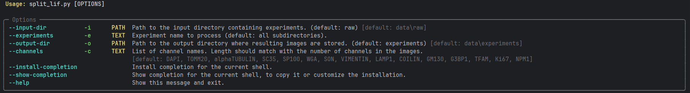
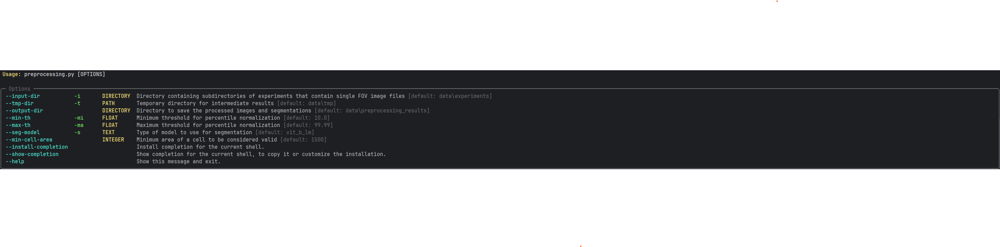
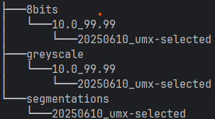
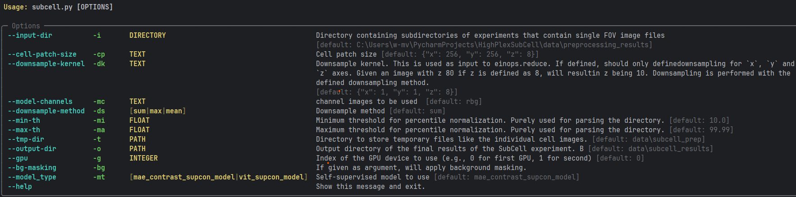

## Overview
This repository provides the end-to-end workflow used in the paper [here](to_be_decided).
The workflow starts with raw image data, processes it and runs SubCell classicication. Results
can be interactively visualized afterwards. The code is specific to the data used in the paper,
but can be adjusted to your own data.

For more information about SubCell, see the [SubCell paper](https://www.biorxiv.org/content/10.1101/2024.12.06.627299v2).

## Expected directory structure and naming

### Configs
First there should be a `configs` directory. This directory contains configurations for the interactive visualization with bokeh:
        
#### colormaps.json
This file defines how elements are colored in the umap and in the boxplots.
By default elements are colored with Category10 colormap.
This file can be added for customizations.
The file needs to be structured as json, each top-level key corresponds to the column in the data (condition, cell_cycle_phase, image_name, ...), its corresponding value needs to be a dictionary that maps each element to a color.
Here is an example in which for cell_id the colormap used is Turbo, while for the condition custom colors are defined.
```
{
    "cell_id": "Turbo",
    "condition": {
        "Untreated": "#d81b60",
        "SA": "#1e88e5",
        "ActD": "#ffc107",
        "Unknown": "#7f7f7f"
    },
}
```

#### constants.yaml
This file contains:
- the list of the 30 subcell classes,
- the mapping used to condense them into 15 classes (e.g. Nucleoli was redefined as Nucleoli + Nucleoli fibrillar center + Nucleoli rim),
- the list of 15 channel names.

#### umap_config.yaml
This file can be used to customize the umap output. Different elements can be customized:

- The minimum width of the side panels can be defined.
- The initial transparence of the points.
- The maximum number of elements shown in the legend can be customized, this is particularly useful when coloring by cell_id, where the number of unique values if very large but the representation is useful to see whether all markers for a cell cluster together. ```The tooltip can be then used to extract the cell_id if needed. ```

- A list of cells to be highlighted, along with the color and width of the border around the highlighted cell can be customized.

- The marker shapes, first a list of markers can be defined along with their sizes, then the column for which the shapes will be changed can be selected, and finally for each element of the column a partiular marker can be defined.

- tooltip elements can be chosen. Each element requires two values: 'column' which is the name of the column in the dataframe, and 'label' which is what will be shown in the tooltip.

### Image Data
The raw image data should be stored in a directory called `data`, which is present in this project directory.
In this directory, for running the workflow with default parameters, it is expected that there is a directory called 
`raw`. This directory contains experiment directories with names of the user's choice, that should contain either
`.lif` or `.tif`, `.tiff` images. The dimension names and order of these images is expected to be `czyx`. The images
can contain one or multiple scenes (Fields of View).

## Getting started

### Installing Pixi

This project uses [pixi](https://pixi.sh) for dependency management. To install pixi, follow these steps
(check installation instructions [here](https://pixi.prefix.dev/latest/installation/) in case of potential outdated instructions):

#### Windows
You can download and run the [installer](https://github.com/prefix-dev/pixi/releases/latest/download/pixi-x86_64-pc-windows-msvc.msi)
or run the following:
```
# Using PowerShell (recommended)
powershell -ExecutionPolicy ByPass -c "irm -useb https://pixi.sh/install.ps1 | iex"
```
The terminal needs to be restarted to make the installation effective. See details below for what this does.
<details>
The above invocation will automatically download the latest version of pixi, extract it, and move the pixi binary to 
%UserProfile%\.pixi\bin. The command will also add %UserProfile%\.pixi\bin to your PATH environment variable, allowing 
you to invoke pixi from anywhere.
</details>

If you want to turn on autocompletion check the location of your profile by running in the
PowerShell: `$PROFILE`. At the end of this file add the following line:

```(& pixi completion --shell powershell) | Out-String | Invoke-Expression```
#### macOS/Linux
```
# Using curl
curl -fsSL https://pixi.sh/install.sh | sh

# Or using wget if you don't have curl
wget -qO- https://pixi.sh/install.sh | sh
```

Now restart your terminal or shell to make the installation effective. For what this does, see the windows section.
To enable autocompletion, add to your `.bashrc`:
```eval "$(pixi completion --shell bash)"```

### Installing Dependencies

Once pixi is installed, you can install the project dependencies:

```
# Install all dependencies
pixi install -a
```

This installs the dependencies for all environments related to this project.

## Running the workflow

### Overview of subcell workflow
#### Splitting images into 1 scene per image file
The workflow starts from either raw `.lif` or `.tif` / `tiff` images. These are split into individual channel
images by running a CLI. To run with default parameters, in the command line ensure that you are in this repository directory and run: 

`pixi run split_images`

Additional parameters can be provided:


Both `experiments` and `channels` can be a list of strings. The way to provide multiple channels for example is:
`pixi run split_images -c ch1 -c ch2 -c ch3`

#### Preprocessing of images
The code for preprocessing of the images includes a percentile normalization step as well segmentation
using micro-sam (paper [here](https://www.nature.com/articles/s41592-024-02580-4)). Due to naming,
the code is specific to the data used in the paper. To run it, run the following in a terminal with this
directory as current working directory:

`pixi run preprocess`

Additional parameters can be provided (please also see mentioned defaults):


By default, the preprocessing output and intermediate results are stored in `data/preprocessing_results`. This directory
will contain three directories: `8bits`, `greyscale` and `segmentations`. The `8bits` folder contains a directory 
`<min-th_max-th` containing normalized 8 bit images. The `greyscale` directory contains the 8 bit images which are 
filtered to only include the segmentation channels (`DAPI`, `VIMENTIN`, `WGA`, `alphaTUBULIN`), sum projected, normalized
and converted to 8 bit. These images are used as input for segmentation, the output of which are stored in the 
third directory called `segmentations`. The directory structure after running the preprocessing should look something
like this:



It can be that segmentations have to be corrected afterwards. Subcell is expecting close to perfect segmentations. When 
stored using the same name as the automated segmentation image in a directory called `manual_segmentations` within the 
directory choosen as output directory, segmentation will be skipped if automated segmentation is rerun (this is also
the case for any automated segmentations already existing).

<details>
It can be that you see an error message when the segmentation images are being read for automated cleaning (removing
small segmentation objects and border cells). This is because micro-sam does store tiff, but `bioio` tries to read
first with the `bioio-ome-tif` reader, before falling back to the basic `tif` reader. This message can be ignored.
</details>

#### Running subcell
To run SubCell with the default configuration, just run the following from the terminal:

`pixi run subcell`

By default, the input data expects the `preprocessing_results` directory as input with in there the `8bit` directory
containing the 8 bit images generated during preprocessing. Percentile normalization can be performed prior to running 
the SubCell model. For more information see the `--help`:



For preprocessing, first cells are extracted based on the mask and the centroids are determined through defining 
regionprops. The centroids are then used to create cell patch images the size of which corresponds to 
`--cell-patch-size` (these are stored in . Next by default, the individual cell images are sum projected after which a 
per channel normalization is applied (1st and 99th percentile) with subsequent rescaling of values between 0 and 1. 
If `--bg-masking` is supplied as argument, the background will be masked out from the individual cell images. However,
this is not the default. Images are then fed to the SubCell model of choice. The final


Raw images (LIF / TIFF)
        ↓
1. split_lif
        ↓
2. preprocessing
        ↓
3. subcell
        ↓
4. hv_plot
        ↓
Interactive dashboard (Panel) and/or SVG figures


- split_lif.py, split raw image files containing multiple scenes.

- preprocessing, prepares to run subcell with preprocessing, segmenting, and mask post-processing.

- subcell, prepares the dataset for subcell, and runs it.

- hv_plot, creates an interactive plot and saves an svg file.